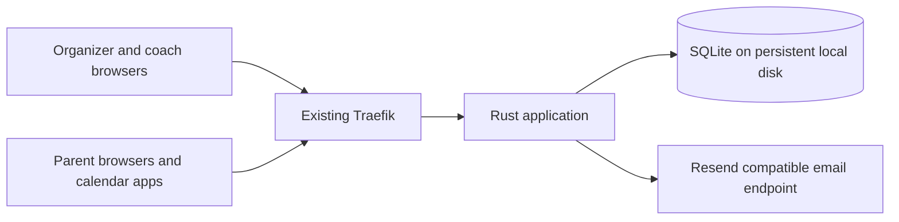

# Gymtime Architecture

Gymtime will run as one Rust application behind the owner's existing Traefik proxy. It will serve the JSON API, public calendar feeds, static landing page, and Lit frontend assets. SQLite will hold the schedule and account data on a persistent local volume. Email delivery will use the configured Resend-compatible endpoint.

This is the architecture specification for the first version. It makes the reviewed requirements concrete for implementation; the application described here has not been built. Product behavior comes from [Requirements](docs/requirements.md), and the owner's stack choices come from [Engineering decisions](docs/engineering.md).

## Runtime boundaries

The browser owns presentation and request state. Rust owns authorization and every schedule mutation. SQLite persists decisions, and a background task delivers committed notifications. Node is needed for frontend builds and development, not for the production application process.

The landing page is generated at build time through Lit's server rendering tools. It contains readable HTML and working sign-in navigation without JavaScript. Authenticated screens and shared team webpages render on the client. Parent subscription feeds are server responses and do not require browser JavaScript. See [Frontend architecture](docs/frontend.md) for the Lit and Effect boundary.

Production uses one application instance. Supporting multiple concurrent HTTP requests does not require multiple database writers or application replicas.

## Rust layers

| Crate | Responsibility | Allowed project dependencies |
| --- | --- | --- |
| `gymtime-domain` | Validated identifiers, intervals, role and lifecycle types, pure scheduling decisions | None |
| `gymtime-app` | Use cases, authorization decisions, transaction orchestration, service ports | Domain |
| `gymtime-infra` | SQLite repositories, transaction guards, email SDK, clock, random values, and identifiers | App and domain |
| `gymtime-api` | Axum routes, request and response DTOs, session extraction, OpenAPI, feed encoding, and static route policies | App and domain |
| `gymtime-server` | Configuration, migrations, bootstrap, dependency wiring, HTTP startup, worker lifecycle | API, infra, app, and domain |

Only the server connects concrete infrastructure to application ports. The domain has no async runtime, SQL driver, web framework, clock access, or random generation. The app has no SQLx or infrastructure dependency. Infrastructure translates driver and SDK failures into named port errors; handlers translate application errors into the public error contract.

Use newtypes for identifiers and constrained values, exhaustive enums for states, and `Result` with named errors for fallible decisions. Raw JSON, database rows, environment variables, and provider responses are boundary data. Parse them into valid types before passing them inward. Domain state cannot be reconstructed through an unchecked public constructor.

## Scheduling records

The following records summarize the application model. [Migration reference](docs/schema.md) documents the implemented SQL schema.

| Records | Purpose |
| --- | --- |
| Gym settings and spaces | Gym timezone, open hours, and the mapping from bookable spaces to occupied portions of the gym |
| Seasons | Draft, active, and closed seasons, with named date ranges |
| Teams and season memberships | Stable team identities, season participation, and primary or assistant coach assignments |
| Users, organizer grants, and invitations | Invitation-only accounts and gym administration access |
| Slot templates and dated slots | Organizer-defined repeating availability and its concrete occurrences |
| Closures | Unavailable intervals and their affected gym portions |
| Request series and dated requests | Coach requests, competing reasons, partial approval, withdrawal, and decision history |
| Bookings and allocations | Confirmed team reservations, occupied gym portions, versions, and cancellation records |
| Change and swap proposals | Pending changes, the original booking versions, acceptance, withdrawal, and expiry |
| Notification events, recipient records, and email outbox | In-app delivery, email attempts, and grouped messages |
| OTP challenges and sessions | Short-lived verification state and revocable authenticated sessions |
| Team sharing tokens and audit events | Public schedule links and a history of who changed scheduling state |

A user can be an organizer and a coach, or coach multiple teams. Team action permissions come from the user's assignment for that team and season. Keep past membership and scheduling history rather than rewriting it when a primary coach changes. Organizers can update current assignments; assistant coaches remain viewers.

Use a database constraint to permit only one active season. Use one current primary assignment per team; team-season associations control participation. Availability and request status remain distinct: a pending request does not own a slot.

## Gym portions and interval conflicts

Represent each bookable space as a set of atomic gym portions. With a split gym, Half A occupies `{A}`, Half B occupies `{B}`, and Full Gym occupies `{A, B}`. A gym without a split has one portion. This representation must be used by approvals, closures, changes, and swaps.

Intervals are half open: `[start, end)`. Two reservations conflict when their occupied portions intersect and `first.start < second.end` and `second.start < first.end`. Adjacent bookings are allowed. A setup buffer is not part of the agreed first version; the organizer can publish spaced slots when needed.

For example, approving Half A cancels a conflicting Full Gym request but leaves a compatible Half B request pending. Approving Full Gym cancels conflicting requests for both halves. A whole-gym closure cancels all overlapping confirmed bookings and prevents new requests for that time.

Organizer-defined slots may overlap across alternative spaces. Confirmed allocations cannot. Editing the space mapping must not silently change which portions existing bookings occupy.

## SQLite transaction ownership

The app owns the transaction boundary through a `UnitOfWork` port. Its `begin_write` operation returns a transaction-scoped store interface defined in the app crate. That interface supplies validated reads, writes, audit and notification operations, and explicit commit or rollback. SQLx connection and transaction types remain inside infra.

The SQLite adapter implements `begin_write` with an immediate write transaction. Repositories use the adapter's borrowed connection; they cannot independently begin or commit. The infra transaction guard retains SQLx's rollback protection for failures and cancellation, and a connection must be cleaned up before being reused.

Every approval, cancellation, availability change, booking change, and swap follows the same sequence:

1. Begin the write transaction, then read the current account permissions, season, availability, requests, and relevant booking versions.
2. Read the injected clock and run pure decisions against this current state.
3. Write the complete result: bookings and allocations, competing request outcomes, invalidated proposals, audit events, in-app notifications, and email outbox entries.
4. Commit and return the result. An error before commit leaves none of these changes applied.

SQLite permits one writer at a time. Starting the write transaction before the conflict read prevents two approvals from using the same stale availability. Configure foreign keys, WAL mode, and a bounded busy timeout. Retry a transient lock failure only by rerunning the whole transaction against fresh state. [SQLite transaction documentation](https://www.sqlite.org/lang_transaction.html), [WAL documentation](https://www.sqlite.org/wal.html)

Use revision checks on edits and stored versions on swap proposals. A stale proposal returns a conflict instead of overwriting newer data. Authenticated mutations also accept an idempotency key: store the actor, operation, request digest, and result in the transaction. A retry with the same input returns the saved result; reuse with different input is rejected.

## Recurrence and time

The organizer selects the gym's IANA timezone during setup. Do not infer it from a coach's device or the deployment server. Slot templates describe local weekdays and wall-clock times, and expansion produces dated slots within a season. Resolve those slots to UTC instants before saving them.

Coach recurring requests refer to existing dated slots. They cannot create new hours or silently acquire slots published later. Show unavailable or missing dates in the request preview. The organizer approves or declines each requestable occurrence independently.

Changes and cancellations select one occurrence, that occurrence and future dates, or all remaining occurrences. Completed dates retain their history. Closing a season prevents requests and direct booking changes in it; a global gym closure still cancels any affected booking whose time has not completed, across seasons. Removing a closure makes existing published, otherwise available slots requestable again; it does not resurrect canceled bookings.

For daylight-saving transitions, identify nonexistent local times and require an explicit choice for ambiguous times during slot publication. Do not silently move a practice to a different local hour. Webpages display the gym timezone. Calendar feeds preserve the same instants; the receiving calendar controls how it displays them.

## Changes and swaps

A pending change keeps its existing booking confirmed. Approving the change updates the booking and releases the old allocation in one transaction. Declining or withdrawing a proposal leaves that booking in place.

A swap refers to two confirmed booking IDs and their versions. Acceptance requires the receiving team's current primary coach, unchanged original bookings, available spaces, and a time before either booking begins. No organizer approval is involved. Move the two team-associated bookings to each other's slots atomically and increment their versions. The booking identity stays with its team so its calendar event moves rather than becoming a new event.

If a booking changes, is canceled, or is displaced by a closure, invalidate related pending proposals in the same transaction. A swap can be withdrawn before acceptance. Unanswered swaps expire at the earlier start time. A background cleanup updates stored expiry state, but acceptance checks the deadline directly and cannot succeed while cleanup is delayed.

The coach-overlap rule remains a warning. Compatible bookings can be confirmed for two teams with the same primary coach. Include the warning in organizer scheduling views, including the outcome of a swap.

## API contract

The API uses `/api/v1` and JSON. Raw request and response DTOs in the API crate, together with route annotations, generate a committed `contracts/openapi.json` through Utoipa. The generated document is the published wire contract, not a second independently edited schema. Regeneration checks must detect drift. [Utoipa documentation](https://docs.rs/utoipa/latest/utoipa/)

Generate TypeScript transport types from OpenAPI. Effect schemas decode network data into validated frontend values; generated types alone do not validate a response. Assert schema output types against generated transport types and test representative success and error payloads against the contract. Public schedule DTOs are a separate allowlist and never serialize internal notes, request reasons, user emails, or pending requests.

| Route group | Representative operations | Access |
| --- | --- | --- |
| `/auth` | Request code, verify code, inspect session, logout | OTP routes are public and rate limited; session operations use their session |
| `/gym`, `/seasons`, `/teams`, `/invitations` | Setup, season lifecycle, memberships, invitations | Organizer mutations; scheduling reads follow coach visibility |
| `/slots`, `/closures` | Publish availability and block gym time | Organizer mutations; coaches read published scheduling data |
| `/requests` | Submit, edit, withdraw, and decide occurrences | Own-team primary coach actions; organizer decisions |
| `/bookings`, `/changes`, `/swaps` | Read bookings, cancel, request changes, propose and accept swaps | Permission for the particular team and action |
| `/notifications` | Read and mark the current user's notifications | Signed-in user |
| `/public/teams/{token}` | Confirmed team schedule projection | Shared token, no account |

These groups describe use-case ownership. The implemented API uses `/api/v1/auth/*`, `/api/v1/accounts`, `/api/v1/schedule`, `/api/v1/schedule/actions`, `/api/v1/schedule/preview`, `/api/v1/notifications`, `/api/v1/audit`, and `/api/v1/public/teams/{token}`. Calendar files use `/calendars/{token}.ics`. Scheduling commands have an exhaustive operation tag in the generated OpenAPI contract; previews perform permission checks and return affected dates without mutating them.

Use structured error bodies with a stable error code, HTTP status, safe message, request ID, and field issues when relevant. Use 401 for an absent session, 403 for insufficient rights, 404 for an inaccessible or missing shared resource, 409 for stale versions or scheduling conflicts, and 429 for rate limits. Never return database or provider exception strings to users.

## Invitation-only email OTP

The first organizer is seeded from deployment configuration once when a new database is bootstrapped. Restarting the application must not overwrite account permissions. Organizers invite other organizers and team coaches; there is no public signup.

The following are fixed defaults in version 1:

| Setting | Default |
| --- | --- |
| OTP length and expiry | Six numeric digits, valid for 10 minutes |
| Verification limit | Five attempts per challenge |
| Resend cooldown | 60 seconds per email; resend invalidates the previous code |
| Send limits | Five requests per email and 30 requests per trusted client IP per 15 minutes |
| Session limits | Seven days of inactivity and 30 days absolute lifetime |

Use injected cryptographic randomness. Store a keyed digest of the code with its challenge identity, never the code itself. Use one-time transactional consumption. Successful verification creates a random opaque session; store only its digest. The session cookie is `HttpOnly`, `Secure` in production, host scoped, and `SameSite=Lax`. Role changes and disabled users are checked on subsequent actions. Logout revokes the session. Use Origin checking and session-bound CSRF protection for authenticated writes. [OWASP session guidance](https://cheatsheetseries.owasp.org/cheatsheets/Session_Management_Cheat_Sheet.html)

Request-code responses must not reveal whether an email has an invitation. Treat forwarded IP headers as trusted only when they arrive through the configured proxy. Test OTP expiry, replay, resend invalidation, attempt exhaustion, and invitation removal with an injected clock.

OTP delivery is time sensitive. Return the same generic request-code response for invited and uninvited emails, and always offer resend after the cooldown. Detailed delivery failures stay server side; a general outage message must not vary by account membership. Never deliver an expired code from a delayed notification job. OTP plaintext is not stored in the schedule notification outbox or logged.

## Notification delivery

Schedule mutations create one domain event describing all affected dates. Expand it into recipient records using the agreed notification table, with primary and assistant coaches receiving the same team updates. A person coaching multiple teams receives one grouped message per action rather than duplicate messages for the same event.

Persist in-app notifications and email jobs before transaction commit. After commit, a structured background task claims pending jobs using a short transaction, releases the database lock, sends through the configured SDK, and records the result in another short transaction. Never wait for the network while holding a booking write lock.

Use a stable delivery identity and provider idempotency key where supported. Retry transient failures with bounded backoff; retain failed jobs for organizer inspection rather than deleting them. A crash between provider acceptance and local acknowledgment may still cause redelivery if the endpoint lacks matching idempotency behavior, so verify that behavior in the email adapter tests.

Start the delivery and expiry tasks through a managed Tokio task group. Shutdown stops claims, allows bounded completion, closes the pool, and leaves unfinished jobs recoverable. No reminders are added to this worker in version 1.

## Team webpages and calendar feeds

Each team has a random sharing token. The webpage and subscription use that token without a parent account. They expose only published confirmed activities for that team. Show the gym's timezone and omit notes and pending or unsuccessful requests.

The landing page is eligible for indexing. Apply `noindex` to team webpages and `X-Robots-Tag: noindex` to public data and calendar responses. Exclude team tokens from sitemap entries, landing-page links, and logs. Do not block these URLs in `robots.txt` in a way that prevents a crawler reading the exclusion directive. [Google indexing guidance](https://developers.google.com/search/docs/crawling-indexing/block-indexing)

Serve subscription files over HTTPS as `text/calendar`, with a webcal subscription action and an HTTPS fallback link. Use stable team-associated booking UIDs, incrementing sequences, UTC start and end instants, and proper escaping and line folding. Retain cancellation entries for the published season so a subscribing client can remove canceled occurrences. The webpage's upcoming list excludes canceled activities. Follow [RFC 5545](https://www.rfc-editor.org/info/rfc5545/).

Shared team links remain stable across published seasons for the same team; draft data is excluded. Feed refreshes are controlled by the receiving calendar. Changing a booking must not produce duplicate UIDs. The first version's downloadable coach schedule is an `.ics` file using the same encoding; separate spreadsheet and PDF exports are deferred unless requested.

Organizers and a team's primary coach can replace its sharing token. The confirmation explains that the old webpage and feed stop working and existing subscribers need the new URL.

## Deployment and observability

Build the frontend and Rust binary in separate stages, then package the assets and binary in one non-root `linux/amd64` application image. Mount the SQLite directory on a persistent local volume. The only production service in the project's Compose file is the application; Traefik is external and reached through its existing network and configured labels.

Configuration includes the public base URL, internal HTTP port, database path, initial organizer email, auth secret, Resend base URL, API key and sender, trusted proxy ranges, and the Traefik routing values. Parse it once at startup and reject invalid values with redacted errors. Keep the API key and auth secret out of frontend build arguments and assets.

Migrations finish before readiness. Liveness checks the process; readiness checks schema and database availability. Email failure does not make a committed schedule unavailable. Serve hashed assets with immutable caching and schedule or session responses with appropriate private or no-store policies.

Log request IDs, action identifiers, duration, transaction results, and email attempt outcomes as structured records. Do not log OTPs, session tokens, sharing tokens, API keys, notes, or full recipient addresses. The organizer's change history comes from audit records, not operational log retention.

Use a SQLite-consistent backup procedure and test restore into a separate directory. A container rollback cannot undo a database migration; release instructions must pair compatible application versions with a tested restore procedure.

## Verification boundaries

Architecture checks enforce crate and TypeScript import directions. Contract checks regenerate OpenAPI and transport types. Domain property tests cover interval symmetry, half-gym compatibility, valid state transitions, and recurrence selection. File-backed SQLite tests use separate connections to prove conflicting approvals and competing swap acceptances cannot both succeed, and injected failures leave no partial changes.

Browser tests cover real custom elements, keyboard actions, accessible forms, mobile schedule views, and parent data omission. Test Chromium and WebKit, with Firefox included in release checks. Playwright WebKit provides browser-engine coverage; a real iPhone subscription smoke check remains part of release validation.

The foundation's narrower acceptance boundary and root command interface are specified in [Scaffold specification](docs/scaffold.md). Implementation and test evidence are recorded in [Verification](docs/verification.md); the requirements acceptance scenarios remain the completion boundary.
